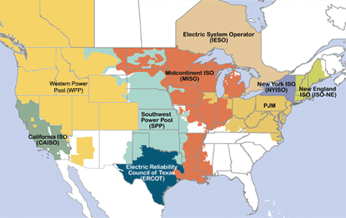

# Project Overview & Findings

This project compares retail electricity standard-offer rates with aggregated wholesale PJM prices across service territories.

The central deliverable is an interactive map-based dashboard that lets users inspect:

- where service territories are located,
- which wholesale pricing points are mapped to each territory,
- how retail and wholesale values compare across territories,
- and how those comparisons change over time.

## 1. Scope and deliverable

This repository supports two use cases:

1. **Static public demo** served through GitHub Pages using snapshot files.
2. **Full local run** with backend connectivity for credentialed users.

The intended outcome is transparency: helping users observe and verify retail-vs-wholesale differences by territory and month.

## 2. Main findings

1. **Retail-vs-wholesale relationships are not uniform across PJM territories.**
2. **Irregularities appear both within and between neighboring territories.**
3. **Retail rates remain materially disparate even when service territories exhibit similar wholesale price levels over multi-year windows.**
4. **Wholesale price movements appear to transmit to retail rates less strongly than expected, given that wholesale energy commonly accounts for roughly 60-70% of retail rate composition.**
5. **These persistent mismatches warrant deeper root-cause investigation.**

This project is an analysis and interpretation tool, not a final causal model of why those mismatches occur.

## 3. Key constraints that shaped the implementation

1. **Access and permission constraints:** backend and storage permissions had to balance secure access with practical runtime performance.
2. **LMP-to-territory matching complexity:** selecting representative pricing points for each territory required substantial preparation work.
3. **PJM API limits:** roughly six requests per minute and 50,000-row result limits constrained historical collection.
4. **Older historical retrieval overhead:** 2+ year old data is archived and querying with filters is not possible.  This required broad pulls and local filtering.

## 4. Repository layout at a glance

| Area | Purpose |
| :--- | :--- |
| `src/` | Dashboard pages, UI components, styling, and documentation |
| `api/` | FastAPI backend for live local queries |
| `src/hydrate/` | Data maintenance and hydration scripts |
| `src/data/demo/` | Snapshot files used by the GitHub Pages demo |

## 5. Where to go next

1. Read [Setup / Environment](./SETUP) to run the project and reproduce outputs.
2. Read [User Guide](./USER_GUIDE) to interpret controls, layers, and chart behavior.

### Developer continuation roadmap

1. **Extend the template to other ISOs and service territories.**
	Use the current PJM implementation as a template for adding other North American ISO balancing areas and their related service territories. The visual below identifies target ISO regions that can be added in future iterations.

	

2. **Build service-territory load profiles.**
	Replace or augment simple wholesale price averaging with load-weighted calculations so average wholesale costs reflect usage patterns by hour, month, and territory.

3. **Add additional wholesale cost components.**
	Incorporate capacity charges, demand costs, and renewable energy credits (RECs) into the comparative framework. These categories may represent 30% or more of the total cost borne by retail service companies when supplying retail customers.